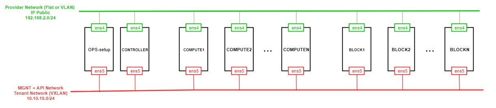

# Cài OpenStack Pike với Linux bridge sử dụng scripts


# MỤC LỤC
- [1.Mô hình](#1)
- [2.IP Planning](#2)
- [3.Cài đặt](#3)
- [4.Mở rộng cho N node Compute và N node Block](#$)


<a name="1"></a>
# 1.Mô hình
\- Mô hình cài đặt OpenStack Pike gồm 1 node Controller, 2 node Compute, 2 node Block. Scripts có thể mở rộng cài 1 node Controller, N node Compute và N node Block.  
\- Cài đặt các project: Keystone, Glance, Nova, Neutron, Horizon, Cinder, Heat.  



<a name="2"></a>
# 2.IP Planning
Yêu cầu phần cứng và địa chỉ IP cho các nodes.


<a name="3"></a>
# 3.Cài đặt
\- **Yêu cầu**: Trên tất cả các node đều cài ssh server và được cấu hình cho phép ssh qua `root`.  
\- **Chú ý**: Thực hiện các lệnh sau với quyền `root`.  
\- **Trên tất cả các node**   
  - Download file shell script. Thực hiện các câu lệnh sau:  
  ```
  wget https://raw.githubusercontent.com/doxuanson/Install-OpenStack/master/Pike/OPS-setup/ip_setup.sh
  ```

 - Thực hiện script setup địa chỉ IP cho **Provider Network** theo mô hình theo cú pháp:  
  ```
  source ip_setup.sh <node_name> <NIC_name> <IP_address> <netmask> <gateway>
  ```

  Ví dụ trên node **Controller**:  
  ```
  source ip_setup.sh controller ens4 192.168.2.61 255.255.255.0 192.168.2.1
  ```

  - Sau khi setup địa chỉ IP, ta sử dụng địa chỉ IP đó để ssh vào tất cả các node để thực hiện scripts.  

\- **Trên node OPS-setup**  
  - Download các file shell scripts. Thực hiện các câu lệnh sau:  
  ```
  apt-get install subversion -y
  svn export https://github.com/doxuanson/Install-OpenStack/tree/master/Pike/OPS-setup
  ```
  - Set quyền cho các files.  
  ```
  chmod -R 755 OPS-setup
  chmod -R 600 OPS-setup/KEY
  ```

  - Cấu hình các phần sau cho tất cả các node trong file `OPS-setup/config.sh`:  
    - mô hình cài đặt (`provider` hoặc `selfservice`)
    - địa chỉ IP  
    - tên ổ cứng của các node Block
    - hostname
    - password các node
    - password các service trong OpenStack
  
  - Cài đặt các project trên node Controller, thực hiện các lệnh sau:  
    ```
    cd OPS-setup/CTL
    source ssh_ctl-all.sh
    ```
    
  - Cài đặt các project trên các node Compute  
    - Ta mở file `OPS-setup/COM/com_num.sh` và ghi vào nội dung như sau:  
    ```
    COM_NUM=N
    ```

    N tương ứng với node Compute cần cài, ví dụ với Compute1:  
    ```
    COM_NUM=1
    ```  
    
    - Sau đó, ta thực hiện các lệnh sau:  
    ```
    cd OPS-setup/COM
    source ssh_com-all.sh
    ```

  - Cài đặt các project trên các node Block  
    - Ta mở file `OPS-setup/BLK/com_num.sh` và ghi vào nội dung như sau:  
    ```
    BLK_NUM=N
    ```

    N tương ứng với node Block cần cài, ví dụ với Block1:  
    ```
    BLK_NUM=1
    ```  
    
    - Sau đó, ta thực hiện các lệnh sau:  
    ```
    cd OPS-setup/BLK
    source ssh_blk-all.sh
    ```

<a name="4"></a>
# 4.Mở rộng cho N node Compute và N node Block
\- Ta thêm các thông tin về:  
- địa chỉ IP  
- tên ổ cứng đối với node Block
- hostname
- password node

vào file `OPS-setup/config.sh`. Sau đó, thực hiện các bước cài đặt bên như trên.


