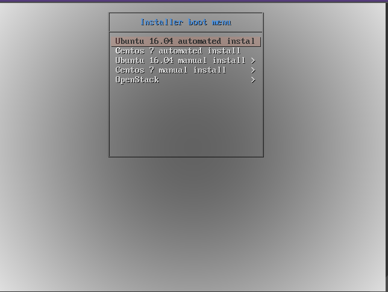

# Cài đặt OpenStack với Linux bridge sử dụng công nghệ PXE và Kickstart

# MỤC LỤC


<a name="1"></a>
# 1.Mô hình
\- Mô hình cài đặt OpenStack Pike gồm 1 node Controller, 2 node Compute, 2 node Block. Scripts có thể mở rộng cài 1 node Controller, N node Compute và N node Block.  
\- Cài đặt các project: Keystone, Glance, Nova, Neutron, Horizon, Cinder, Heat.  


<a name="2"></a>
# 2.IP Planning
Yêu cầu phần cứng và địa chỉ IP cho các nodes.


<a name="3"></a>
# 3.Cài đặt trên OPS-setup
\- Cài hệ điều hành Ubuntu Server 16.04.  
<a name="3.1"></a>
## 3.1.Cài đặt và cấu hình DHCP Server
\- Cài phần mềm isc-dhcp-server làm DHCP server:  
```
# apt install isc-dhcp-server
```

\- Sửa hoặc tạo ( nếu không có ) 1 file `/etc/default/isc-dhcp-server` với quyền **root** có nội dung như sau :  
```
INTERFACES="ens3"
```

\- Cấu hình 2 dải IP cấp cho client. Mở và cấu hình file:  
```
sudo vi /etc/dhcp/dhcpd.conf
```

và ghi nội dung như sau :  
```
ddns-update-style none;
default-lease-time 600;
max-lease-time 7200;
authoritative;

subnet 172.16.69.0 netmask 255.255.255.0 {
range 172.16.69.50 172.16.69.100;
range 172.16.69.150 172.16.69.200;
option domain-name-servers 172.16.69.1;
option domain-name "network_one";
option routers 172.16.69.1;
option broadcast-address 172.16.69.255;
}
```

\- Khởi động lại dịch vụ `isc-dhcp-server`:  
```
sudo systemctl restart isc-dhcp-server
```

\- Chú ý: tắt các DHCP server khác.  

<a name="3.2"></a>
## 3.2.Cài đặt và cấu hình TFTP Server
\- Cài các gói phần mềm:  
```
# apt-get install tftpd-hpa inetutils-inetd
```

\- Sửa file `/etc/default/tftpd-hpa` :  
```
TFTP_USERNAME="tftp"
RUN_DAEMON="yes"
TFTP_DIRECTORY="/var/lib/tftpboot"
TFTP_ADDRESS=":69"
TFTP_OPTIONS="--secure"
```

\- Sửa file `/etc/inetd.conf` :  
```
[...]
tftp    dgram   udp    wait    root    /usr/sbin/in.tftpd /usr/sbin/in.tftpd -s /var/lib/tftpboot
```

\- Khởi động lại dịch vụ tftpd-hpa:  
```
# systemctl restart tftpd-hpa
```

\- Cấu hình DHCP Server tương thích  với TFTP Server  
Sửa cấu hình dhcp bằng cách sửa file `/etc/dhcp/dhcpd.conf` :  
```
[...]
allow booting;
allow bootp;
option option-128 code 128 = string;
option option-129 code 129 = text;
next-server 172.16.69.101;
filename "pxelinux.0";
```

\- Khởi động lại dịch vụ `isc-dhcp-server`:  
```
# systemctl restart isc-dhcp-server
```

<a name="3.3"></a>
## 3.3.Cấu hình prelinux
>Chú ý : Thực hiện đúng như sau, không nên tự ý thay đổi cách khác.

\- Download file `.iso` Ubuntu Server 16.04, sử dụng câu lệnh sau:  
```
wget http://mirrors.nhanhoa.com/ubuntu-releases/16.04.3/ubuntu-16.04.3-server-amd64.iso
```

\- Thực hiện mount:  
```
# mount -o loop ubuntu-16.04.3-server-amd64.iso /mnt
```

\- Copy netboot image đến thư mục `/var/lib/tftpboot` :  
```
# cp -r /mnt/install/netboot/ubuntu-installer/ /var/lib/tftpboot/
```

\- Thực hiện các command sau:  
```
# cd /var/lib/tftpboot/ubuntu-installer/amd64
mv pxelinux.0 ../..
mv pxelinux.cfg/ ../..
mv boot-screens/ ../..
cd ../..
mv boot-screens/ldlinux.c32 .
chmod 644 boot-screens/*
rm -rf ubuntu-installer/
```

\- Sửa nội dung file `boot-screens/syslinux.cfg`:  
```
# D-I config version 2.0
# search path for the c32 support libraries (libcom32, libutil etc.)
path boot-screens/
include boot-screens/menu.cfg
default boot-screens/vesamenu.c32
prompt 0
timeout 0
```

\- Sửa nội dung file `boot-screens/menu.cfg` :  
```
menu hshift 13
menu width 49
menu margin 8
menu tabmsg

menu title Installer boot menu
label auto-ubuntu-16.04
        menu label ^Ubuntu 16.04 automated install
        kernel ubuntu-installer/amd64/linux
        append ks=http://172.16.69.101/ksubuntu.cfg vga=normal initrd=ubuntu-installer/amd64/initrd.gz
label auto-centos-7
        menu label ^Centos 7 automated install
        kernel centos-installer/vmlinuz
        append ks=http://172.16.69.101/kscentos.cfg vga=normal initrd=centos-installer/initrd.img

menu begin ubuntu-16.04
        menu title Ubuntu 16.04 manual install
        label mainmenu
                menu label ^Back..
                menu exit
        include ubuntu-installer/amd64/boot-screens/menu.cfg
menu end
menu begin centos-7
        menu title Centos 7 manual install
        label mainmenu
                menu label ^Back..
                menu exit
        include centos-installer/default
menu end

menu begin OpenStack
        menu title OpenStack
        label mainmenu
                menu label ^Back..
                menu exit
                label OpenStack-CTL
                                menu label ^OpenStack-CTL
                                kernel ubuntu-installer/amd64/linux
                                append ks=http://172.16.69.101/kickstart_OPS/ks_CTL.cfg vga=normal initrd=ubuntu-installer/amd64/initrd.gz
                label OpenStack-COM1
                                menu label ^OpenStack-COM1
                                kernel ubuntu-installer/amd64/linux
                                append ks=http://172.16.69.101/kickstart_OPS/ks_COM1.cfg vga=normal initrd=ubuntu-installer/amd64/initrd.gz
                label OpenStack-COM2
                                menu label ^OpenStack-COM2
                                kernel ubuntu-installer/amd64/linux
                                append ks=http://172.16.69.101/kickstart_OPS/ks_COM2.cfg vga=normal initrd=ubuntu-installer/amd64/initrd.gz
                label OpenStack-BLK1
                                menu label ^OpenStack-BLK1
                                kernel ubuntu-installer/amd64/linux
                                append ks=http://172.16.69.101/kickstart_OPS/ks_BLK1.cfg vga=normal initrd=ubuntu-installer/amd64/initrd.gz
                label OpenStack-BLK2
                                menu label ^OpenStack-BLK2
                                kernel ubuntu-installer/amd64/linux
                                append ks=http://172.16.69.101/kickstart_OPS/ks_BLK2.cfg vga=normal initrd=ubuntu-installer/amd64/initrd.gz               
menu end

```

<a name="3.4"></a>
## 3.4.Cấu hình netboot image
\- Như phần trên đã download Ubuntu 16.04 và mount vào thư mục /mnt. Giờ ta copy netboot image đến thư mục `/var/lib/tftpboot` :  
```
# cp -r /mnt/install/netboot/ubuntu-installer/ /var/lib/tftpboot/
```

Sau đó ta umount `/mnt`:  
```
# umount /mnt
```

\- Download Centos 7:  
```
wget http://centos-hn.viettelidc.com.vn/7/isos/x86_64/CentOS-7-x86_64-Minimal-1708.iso
```

\- Thực hiện mount:  
```
# mount -o loop CentOS-7-x86_64-Minimal-1708.iso /mnt
```

\- Copy netboot image đến thư mục `/var/lib/tftpboot` :  
```
# cp -r /mnt/images/pxeboot/ /var/lib/tftpboot/
# mv /var/lib/tftpboot/pxeboot/ /var/lib/tftpboot/centos-install
```

\- Trong thư mục `centos-install`, tạo file `default` với nội dung như sau:  
```
menu title Centos 7 manual install
label 1
        menu label ^1) Install CentOS 7
        kernel centos-installer/vmlinuz
        append initrd=centos-installer/initrd.img method=http://172.16.69.101/centos7
```

<a name="3.5"></a>
## 3.5.Cấu hình để PXE client cài Ubuntu Server 16.04 và Centos 7 từ repo local
\- Cài web server apache2:  
```
sudo apt-get install apache2
```

\- Tạo thư mục `ubuntu-16.04` và `centos7` trong thư mục `/var/www/html` :  
```
sudo mkdir /var/www/html/ubuntu-16.04
sudo mkdir /var/www/html/centos7
```

\- Thực hiện mount:  
```
# mount -o loop ubuntu-16.04.3-server-amd64.iso /var/www/html/ubuntu-16.04
```

và viết thêm vào cuối file `/etc/fstab` :  
```
/root/images/ubuntu-16.04.3-server-amd64.iso /var/www/html/ubuntu-16.04 auto defaults 0 0
```

\- Ở trên đã mount `CentOS-7-x86_64-Minimal-1708.iso` vào thư mục `/mnt` . Giờ ta copy:  
```
# cp -r /mnt/* /var/www/html/centos7/
```

Sau đó ta umount `/mnt`:  
```
# umount /mnt
```

<a name="3.6"></a>
## 3.6.File kickstart cho hệ điều hành Ubuntu 16.04 và Centos 7
\- File kickstart cho `Ubuntu 16.04`:  
Tạo file `/var/www/html/ksubuntu.cfg` với nội dung như sau:  
```
#Generic Kickstart template for Ubuntu
#Platform: x86 and x86-64

#System language
lang en_US

#Language modules to install
langsupport en_US

#System keyboard
keyboard us

#System timezone
timezone Asia/Ho_Chi_Minh

#Root password
rootpw son123456

#Initial user (user with sudo capabilities) 
user ubuntu --fullname "Ubuntu User" --password son123456

#System authorization infomation
auth  --useshadow  --enablemd5 

#Reboot after installation
reboot

#Use text mode install
text

#System bootloader configuration
bootloader --location=mbr

#Partition clearing information
clearpart --all

#Basic disk partition
part / --fstype ext4 --size 5 --grow --asprimary
part swap --size 1024
part /boot --fstype ext4 --size 256

#Network information
network --bootproto=dhcp --hostname ubuntu

# config repo source.list
url --url http://172.16.69.101/ubuntu-16.04

#Do not configure the X Window System
skipx

# Install packet for the system
%packages  --ignoremissing
@ ubuntu-server
openssh-server

# Run script after installation
%post
## Config grub
sed -i 's/GRUB_HIDDEN_TIMEOUT=0/#GRUB_HIDDEN_TIMEOUT=0/g' /etc/default/grub
sed -i 's/quiet splash//g' /etc/default/grub
update-grub
## Config ssh
sed -i 's/PermitRootLogin prohibit-password/PermitRootLogin yes/g' /etc/ssh/sshd_config
##Config repo
sed -i 's|172.16.69.101/ubuntu-16.04|vn.archive.ubuntu.com/ubuntu|g' /etc/apt/sources.list

apt-get update -y && apt-get upgrade –y
cd /root
mkdir test
%end
```

\- File kickstart cho Centos 7:  
Tạo file `/var/www/html/kscentos.cfg` với nội dung như sau:
```
```

<a name="3.7"></a>
### 3.7.Cấu hình cài đặt tự động cho OpenStack
\- Download các file shell scripts. Thực hiện các câu lệnh sau:  
```
apt-get install subversion -y
svn export https://github.com/doxuanson/Install-OpenStack/trunk/Pike/Use-PXE-KS/Linuxbridge/OPS-setup
svn export https://github.com/doxuanson/Install-OpenStack/trunk/Pike/Use-PXE-KS/Linuxbridge/kickstart_OPS
```

\- Copy 2 thư mục vừa tải về vào thư mục `/var/www/html` :  
```
# cp OPS-setup /var/www/html
# cp kickstart_OPS /var/www/html
```

<a name="4"></a>
# 4.Hướng dẫn sử dụng
\- Thay đổi nội dung các file `/var/www/html/OPS-setup/config.sh` và `/var/www/html/kickstart_OPS/config.sh` theo mô hình của bạn.  

>Chú ý: Mật khẩu cho node phải đồng nhất trong 2 file cấu hình.

\- Trong bài lab này, mình cài đặt mô hình OpenStack gồm 1 node Controller, 2 node Compute và 2 node Block nhưng bạn cũng có thể mở rộng mô hình gồm 1 node Controller, n node Compute và n node Block bằng cách thêm các biến thêm vào file `/var/www/html/OPS-setup/config.sh`.  

<a name="4.1"></a>
## 4.1.Tạo file kickstart cho các node OpenStack
\- Dùng các file trong thư mục `/var/www/html/kickstart_OPS` để sinh các file kickstart cho các node OpenStack.  
```
cd /var/www/html/kickstart_OPS
```

  - Sinh file kickstart cho node Controller:  
  ```
  source CTL_ks_create.sh
  ```

  - Sinh file kickstart cho node Compute1, đầu tiên cho thiết lập biến `com_num` bằng `1` (`com_num=1`) trong file config.sh, sau đó:
  ```
  source COM_ks_create.sh
  ```

  - Tương tự sinh file kickstart cho node Compute2, thiết lập biến `com_num` bằng `2` (`com_num=2`) trong file config.sh, sau đó:  
  ```
  source COM_ks_create.sh
  ```

  - Sinh file kickstart cho node Block1, đầu tiên cho thiết lập biến `blk_num` bằng `1` (`blk_num=1`) trong file config.sh, sau đó:
  ```
  source BLK_ks_create.sh
  ```

  - Tương tự sinh file kickstart cho node Block2, thiết lập biến `blk_num` bằng `2` (`blk_num=2`) trong file config.sh, sau đó:  
  ```
  source BLK_ks_create.sh
  ```

<a name="4.2"></a>
## 4.2.Mở rộng cho n node Compute và n node Block
\- Thiết lập thêm các biến thêm vào file `/var/www/html/OPS-setup/config.sh`.  
\- Tương tự như phần **4.1.Tạo file kickstart cho các node OpenStack**, tạo thêm các file kickstart tương ứng.  
\- Thêm nội dung node mới vào file `boot-screens/menu.cfg`, ví dụ ta thêm Compute3:  
```
[...]
menu begin OpenStack
        menu title OpenStack
        label mainmenu
                menu label ^Back..
                menu exit
                label OpenStack-CTL
                                menu label ^OpenStack-CTL
                                kernel ubuntu-installer/amd64/linux
                                append ks=http://172.16.69.101/kickstart_OPS/ks_CTL.cfg vga=normal initrd=ubuntu-installer/amd64/initrd.gz
                label OpenStack-COM1
                                menu label ^OpenStack-COM1
                                kernel ubuntu-installer/amd64/linux
                                append ks=http://172.16.69.101/kickstart_OPS/ks_COM1.cfg vga=normal initrd=ubuntu-installer/amd64/initrd.gz
                label OpenStack-COM2
                                menu label ^OpenStack-COM2
                                kernel ubuntu-installer/amd64/linux
                                append ks=http://172.16.69.101/kickstart_OPS/ks_COM2.cfg vga=normal initrd=ubuntu-installer/amd64/initrd.gz
                label OpenStack-COM3
                                menu label ^OpenStack-COM3
                                kernel ubuntu-installer/amd64/linux
                                append ks=http://172.16.69.101/kickstart_OPS/ks_COM3.cfg vga=normal initrd=ubuntu-installer/amd64/initrd.gz
                label OpenStack-BLK1
                                menu label ^OpenStack-BLK1
                                kernel ubuntu-installer/amd64/linux
                                append ks=http://172.16.69.101/kickstart_OPS/ks_BLK1.cfg vga=normal initrd=ubuntu-installer/amd64/initrd.gz
                label OpenStack-BLK2
                                menu label ^OpenStack-BLK2
                                kernel ubuntu-installer/amd64/linux
                                append ks=http://172.16.69.101/kickstart_OPS/ks_BLK2.cfg vga=normal initrd=ubuntu-installer/amd64/initrd.gz               
menu end

```

<a name="5"></a>
# 5.Demo



\- Ví dụ: ta cài node Controller:  


