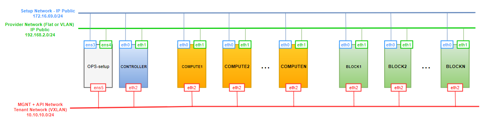
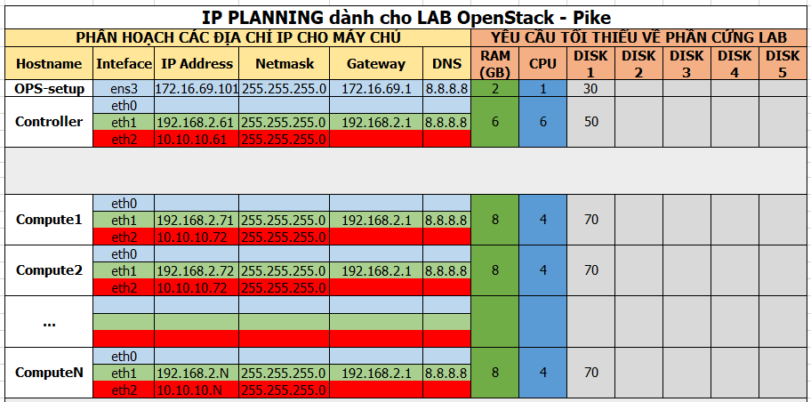
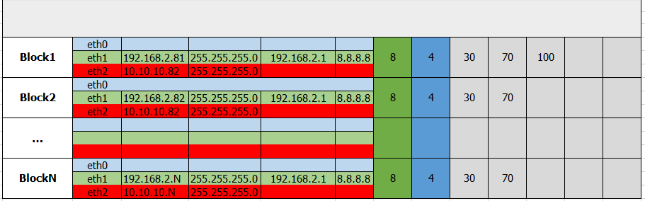
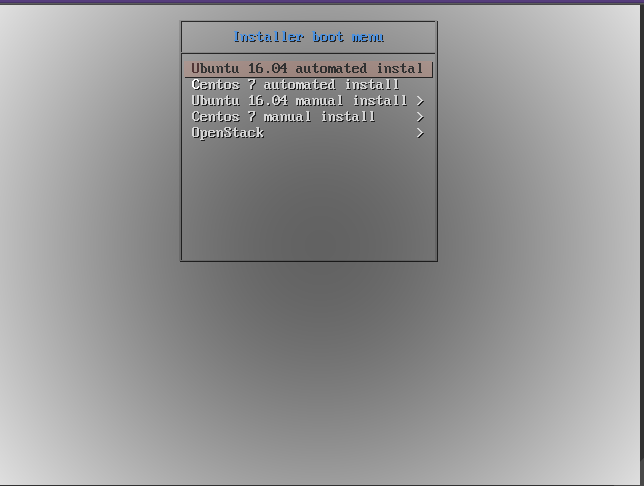
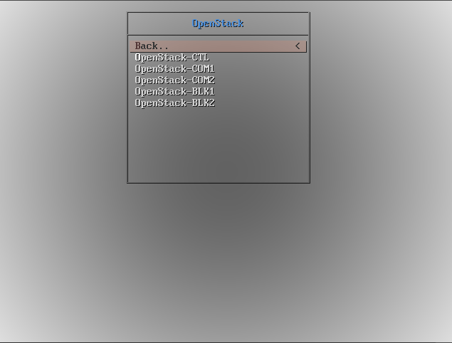
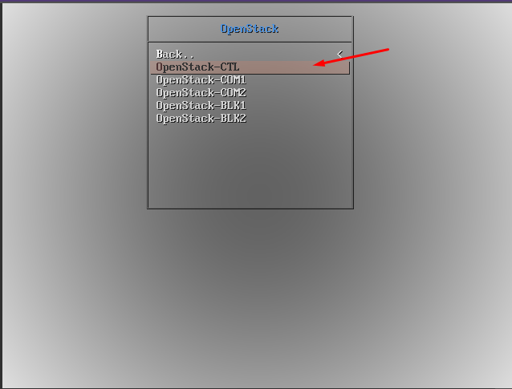

# Cài đặt OpenStack với Open vSwitch sử dụng công nghệ PXE và Preseed

# MỤC LỤC
- [1.Mô hình](#1)
- [2.IP Planning](#2)
- [3.Cài đặt trên OPS-setup](#3)
	- [3.1.Cài đặt và cấu hình DHCP Server](#3.1)
	- [3.2.Cài đặt và cấu hình TFTP Server](#3.2)
	- [3.3.Cấu hình prelinux](#3.3)
	- [3.4.Cấu hình netboot image](#3.4)
	- [3.5.Cấu hình để PXE client cài Ubuntu Server 16.04 và Centos 7 từ repo local](#3.5)
	- [3.6.Cài apt-cacher-ng](#3.6)
	- [3.7.File preseed và kickstart cho hệ điều hành Ubuntu 16.04 và Centos 7](#3.7)
	- [3.8.Cấu hình cài đặt tự động cho OpenStack](#3.8)
- [4.Hướng dẫn sử dụng](#4)
	- [4.1.Tạo file preseed cho các node OpenStack](#4.1)
	- [4.2.Mở rộng cho n node Compute và n node Block](#4.2)
- [5.Demo](#5)
- [6.Một số chú ý khi cài OpenStack phiên bản Pike với Open vSwitch](#6)

<a name="1"></a>
# 1.Mô hình
\- Mô hình cài đặt OpenStack Pike gồm 1 node Controller, 2 node Compute, 2 node Block. Scripts có thể mở rộng cài 1 node Controller, N node Compute và N node Block.  
\- Cài đặt các project: Keystone, Glance, Nova, Neutron, Horizon, Cinder, Heat.  



<a name="2"></a>
# 2.IP Planning
Yêu cầu phần cứng và địa chỉ IP cho các nodes.




<a name="3"></a>
# 3.Cài đặt trên OPS-setup
\- Cài hệ điều hành Ubuntu Server 16.04.  
<a name="3.1"></a>
## 3.1.Cài đặt và cấu hình DHCP Server
\- Cài phần mềm isc-dhcp-server làm DHCP server:  
```
# apt install isc-dhcp-server
```

\- Sửa hoặc tạo ( nếu không có ) 1 file `/etc/default/isc-dhcp-server` với quyền **root** có nội dung như sau :  
```
INTERFACES="ens3"
```

\- Cấu hình 2 dải IP cấp cho client. Mở và cấu hình file:  
```
sudo vi /etc/dhcp/dhcpd.conf
```

và ghi nội dung như sau :  
```
ddns-update-style none;
default-lease-time 600;
max-lease-time 7200;
authoritative;

subnet 172.16.69.0 netmask 255.255.255.0 {
range 172.16.69.50 172.16.69.100;
range 172.16.69.150 172.16.69.200;
option domain-name-servers 172.16.69.1;
option domain-name "network_one";
option routers 172.16.69.1;
option broadcast-address 172.16.69.255;
}
```

\- Khởi động lại dịch vụ `isc-dhcp-server`:  
```
sudo systemctl restart isc-dhcp-server
```

\- Chú ý: tắt các DHCP server khác.  

<a name="3.2"></a>
## 3.2.Cài đặt và cấu hình TFTP Server
\- Cài các gói phần mềm:  
```
# apt-get install tftpd-hpa inetutils-inetd
```

\- Sửa file `/etc/default/tftpd-hpa` :  
```
TFTP_USERNAME="tftp"
RUN_DAEMON="yes"
TFTP_DIRECTORY="/var/lib/tftpboot"
TFTP_ADDRESS=":69"
TFTP_OPTIONS="--secure"
```

\- Sửa file `/etc/inetd.conf` :  
```
[...]
tftp    dgram   udp    wait    root    /usr/sbin/in.tftpd /usr/sbin/in.tftpd -s /var/lib/tftpboot
```

\- Khởi động lại dịch vụ tftpd-hpa:  
```
# systemctl restart tftpd-hpa
```

\- Cấu hình DHCP Server tương thích  với TFTP Server  
Sửa cấu hình dhcp bằng cách sửa file `/etc/dhcp/dhcpd.conf` :  
```
[...]
allow booting;
allow bootp;
option option-128 code 128 = string;
option option-129 code 129 = text;
next-server 172.16.69.101;
filename "pxelinux.0";
```

\- Khởi động lại dịch vụ `isc-dhcp-server`:  
```
# systemctl restart isc-dhcp-server
```

<a name="3.3"></a>
## 3.3.Cấu hình prelinux
>Chú ý : Thực hiện đúng như sau, không nên tự ý thay đổi cách khác.

\- Download file `.iso` Ubuntu Server 16.04, sử dụng câu lệnh sau:  
```
wget http://mirrors.nhanhoa.com/ubuntu-releases/16.04.3/ubuntu-16.04.3-server-amd64.iso
```

\- Thực hiện mount:  
```
# mount -o loop ubuntu-16.04.3-server-amd64.iso /mnt
```

\- Copy netboot image đến thư mục `/var/lib/tftpboot` :  
```
# cp -r /mnt/install/netboot/ubuntu-installer/ /var/lib/tftpboot/
```

\- Thực hiện các command sau:  
```
cd /var/lib/tftpboot/ubuntu-installer/amd64
mv pxelinux.0 ../..
mv pxelinux.cfg/ ../..
mv boot-screens/ ../..
cd ../..
mv boot-screens/ldlinux.c32 .
chmod 644 boot-screens/*
rm -rf ubuntu-installer/
```

\- Sửa nội dung file `boot-screens/syslinux.cfg`:  
```
# D-I config version 2.0
# search path for the c32 support libraries (libcom32, libutil etc.)
path boot-screens/
include boot-screens/menu.cfg
default boot-screens/vesamenu.c32
prompt 0
timeout 0
```

\- Sửa nội dung file `boot-screens/menu.cfg` :  
```
menu hshift 13
menu width 49
menu margin 8
menu tabmsg

menu title Installer boot menu
label auto-ubuntu-16.04
        menu label ^Ubuntu 16.04 automated install
        kernel ubuntu-installer/amd64/linux
        append auto url=http://172.16.69.101/ubuntu-preseed.cfg vga=normal initrd=ubuntu-installer/amd64/initrd.gz locale=en_US keyboard-configuration/layoutcode=us hostname=ubuntu interface=eth0 biosdevname=0 net.ifnames=0
label auto-centos-7
        menu label ^Centos 7 automated install
        kernel centos-installer/vmlinuz
        append ks=http://172.16.69.101/kscentos.cfg vga=normal initrd=centos-installer/initrd.img

menu begin ubuntu-16.04
        menu title Ubuntu 16.04 manual install
        label mainmenu
                menu label ^Back..
                menu exit
        include ubuntu-installer/amd64/boot-screens/menu.cfg
menu end
menu begin centos-7
        menu title Centos 7 manual install
        label mainmenu
                menu label ^Back..
                menu exit
        include centos-installer/default
menu end

menu begin OpenStack
        menu title OpenStack
        label mainmenu
                menu label ^Back..
                menu exit
                label OpenStack-CTL
                                menu label ^OpenStack-CTL
                                kernel ubuntu-installer/amd64/linux
                                append auto url=http://172.16.69.101/preseed_OPS/ps_CTL.cfg vga=normal initrd=ubuntu-installer/amd64/initrd.gz locale=en_US keyboard-configuration/layoutcode=us hostname=ubuntu interface=eth0 biosdevname=0 net.ifnames=0
                label OpenStack-COM1
                                menu label ^OpenStack-COM1
                                kernel ubuntu-installer/amd64/linux
                                append auto url=http://172.16.69.101/preseed_OPS/ps_COM1.cfg vga=normal initrd=ubuntu-installer/amd64/initrd.gz locale=en_US keyboard-configuration/layoutcode=us hostname=ubuntu interface=eth0 biosdevname=0 net.ifnames=0
                label OpenStack-COM2
                                menu label ^OpenStack-COM2
                                kernel ubuntu-installer/amd64/linux
                                append auto url=http://172.16.69.101/preseed_OPS/ps_COM2.cfg vga=normal initrd=ubuntu-installer/amd64/initrd.gz locale=en_US keyboard-configuration/layoutcode=us hostname=ubuntu interface=eth0 biosdevname=0 net.ifnames=0
                label OpenStack-BLK1
                                menu label ^OpenStack-BLK1
                                kernel ubuntu-installer/amd64/linux
                                append auto url=http://172.16.69.101/preseed_OPS/ps_BLK1.cfg vga=normal initrd=ubuntu-installer/amd64/initrd.gz locale=en_US keyboard-configuration/layoutcode=us hostname=ubuntu interface=eth0 biosdevname=0 net.ifnames=0
                label OpenStack-BLK2
                                menu label ^OpenStack-BLK2
                                kernel ubuntu-installer/amd64/linux
                                append auto url=http://172.16.69.101/preseed_OPS/ps_BLK2.cfg vga=normal initrd=ubuntu-installer/amd64/initrd.gz locale=en_US keyboard-configuration/layoutcode=us hostname=ubuntu interface=eth0 biosdevname=0 net.ifnames=0

menu end

```

<a name="3.4"></a>
## 3.4.Cấu hình netboot image
\- Như phần trên đã download Ubuntu 16.04 và mount vào thư mục /mnt. Giờ ta copy netboot image đến thư mục `/var/lib/tftpboot` :  
```
# cp -r /mnt/install/netboot/ubuntu-installer/ /var/lib/tftpboot/
```

Sau đó ta umount `/mnt`:  
```
# umount /mnt
```

\- Download Centos 7:  
```
wget http://centos-hn.viettelidc.com.vn/7/isos/x86_64/CentOS-7-x86_64-Minimal-1708.iso
```

\- Thực hiện mount:  
```
# mount -o loop CentOS-7-x86_64-Minimal-1708.iso /mnt
```

\- Copy netboot image đến thư mục `/var/lib/tftpboot` :  
```
# cp -r /mnt/images/pxeboot/ /var/lib/tftpboot/
# mv /var/lib/tftpboot/pxeboot/ /var/lib/tftpboot/centos-install
```

\- Trong thư mục `centos-install`, tạo file `default` với nội dung như sau:  
```
menu title Centos 7 manual install
label 1
        menu label ^1) Install CentOS 7
        kernel centos-installer/vmlinuz
        append initrd=centos-installer/initrd.img method=http://172.16.69.101/centos7
```

<a name="3.5"></a>
## 3.5.Cấu hình để PXE client cài Ubuntu Server 16.04 và Centos 7 từ repo local
\- Cài web server apache2:  
```
sudo apt-get install apache2
```

\- Ở trên đã mount `CentOS-7-x86_64-Minimal-1708.iso` vào thư mục `/mnt` . Giờ ta copy:  
```
# cp -r /mnt /var/www/html/centos7/
```

Sau đó ta umount `/mnt`:  
```
# umount /mnt
```

\- Thực hiện mount:  
```
# mount -o loop ubuntu-16.04.3-server-amd64.iso /mnt
```

\- Copy thư mục `/mnt` đến `/var/www/html` và đổi tên thành `ubuntu-16.04` :  
```
cp -r /mnt /var/www/html/ubuntu-16.04
```

<a name="3.6"></a>
## 3.6.Cài apt-cacher-ng
\- Cài `apt-cacher-ng` bằng cách thực hiện câu lệnh sau:  
```
sudo apt-get install apt-cacher-ng
```

\- Cấu hình trong file `/etc/apt-cacher-ng/acng.conf` (nếu dòng đó đã được comment thì xóa bỏ dấu "#" để uncomment)  
- Cấu hình thư mục lưu trữ pachage dpkg:  
```
CacheDir: /var/cache/apt-cacher-ng
```

- Lắng nghe trên tất các địa chỉ IP:  
```
# BindAddress: localhost 192.168.7.254 publicNameOnMainInterface
BindAddress: 0.0.0.0
```

- Lắng nghe trên port 3142, nếu cần thay đổi port chúng ta thay đổi tại đây:  
```
Port:3142
```

- Định nghĩa các bản phân phối như Ubuntu, Debian, etc, tất cả cần được cached.  
```
Remap-debrep: file:deb_mirror*.gz /debian ; file:backends_debian # Debian Archives
Remap-uburep: file:ubuntu_mirrors /ubuntu ; file:backends_ubuntu # Ubuntu Archives
Remap-cygwin: file:cygwin_mirrors /cygwin # ; file:backends_cygwin # incomplete, please create this file or specify preferred mirrors here
Remap-sfnet:  file:sfnet_mirrors # ; file:backends_sfnet # incomplete, please create this file or specify preferred mirrors here
Remap-alxrep: file:archlx_mirrors /archlinux # ; file:backend_archlx # Arch Linux
Remap-fedora: file:fedora_mirrors # Fedora Linux
Remap-epel:   file:epel_mirrors # Fedora EPEL
Remap-slrep:  file:sl_mirrors # Scientific Linux
Remap-gentoo: file:gentoo_mirrors.gz /gentoo ; file:backends_gentoo # Gentoo Archives
```

- Nếu cần biên bản báo cáo về `apt-cache` trong web interface, chúng ta cần enable dòng sau:  
```
ReportPage: acng-report.html
```

- Enable log (File log này ghi lại thông tin các package được cached lại trong server)  
```
LogDir: /var/log/apt-cacher-ng
```

- Để có thêm nhiều thông tin về "log", ta uncommnet dòng sau đây:  
```
VerboseLog: 1
```

Chúng ta có thể thiết lập về “0” để chỉ ghi log về type, time, size của packages.  

- Để chạy service apt-cacher-ng, ta enable file pid:  
```
PidFile: /var/run/apt-cacher-ng/pid
```

- Enable xóa bỏ các files không được hỗ trợ:  
```
ExTreshold: 4
```

- Sau khi cấu hình xong, restart service `apt-cacher-ng`.  
```
systemctl restart apt-cacher-ng
```


<a name="3.7"></a>
## 3.7.File preseed và kickstart cho hệ điều hành Ubuntu 16.04 và Centos 7
\- File preseed  cho `Ubuntu 16.04`:  
Tạo file `/var/www/html/ubuntu-preseed.cfg` với nội dung như sau:  
```
#### Contents of the preconfiguration file (for xenial)

### Localization
# Preseeding only locale sets language, country and locale.
#d-i debian-installer/locale string en_US

# Keyboard selection
#d-i console-setup/ask_detect boolean false
#d-i keyboard-configuration/xkb-keymap select us

### Network configuration
#d-i netcfg/choose_interface select auto
#d-i netcfg/get_hostname string ubuntu

### Mirror settings
d-i mirror/country string manual
d-i mirror/http/hostname string 172.16.69.101
d-i mirror/http/directory string /ubuntu-16.04
d-i mirror/http/proxy string

### Account setup
d-i passwd/root-login boolean true
d-i passwd/make-user boolean true

# Root password, either in clear text
d-i passwd/root-password password welcome123
d-i passwd/root-password-again password welcome123

# To create a normal user account.
d-i passwd/user-fullname string Ubuntu User
d-i passwd/username string ubuntu
d-i passwd/user-password password welcome123
d-i passwd/user-password-again password welcome123
d-i user-setup/allow-password-weak boolean true
d-i user-setup/encrypt-home boolean false

# Set to true if you want to encrypt the first user's home directory.
d-i user-setup/encrypt-home boolean false

### Clock and time zone setup
d-i clock-setup/utc boolean true
d-i time/zone string Asia/Ho_Chi_Minh

d-i clock-setup/ntp boolean true
d-i clock-setup/ntp-server string ntp.ubuntu.com

### Partitioning
d-i partman-auto/method string regular
d-i partman-lvm/device_remove_lvm boolean true
d-i partman-md/device_remove_md boolean true
d-i partman-auto/choose_recipe select atomic
d-i partman-partitioning/confirm_write_new_label boolean true
d-i partman/choose_partition select finish
d-i partman/confirm boolean true
d-i partman/confirm_nooverwrite boolean true

### Package selection
tasksel tasksel/first multiselect openssh-server
d-i pkgsel/upgrade select none
d-i pkgsel/update-policy select none

### Boot loader installation
d-i grub-installer/only_debian boolean true

# To install to the first device (assuming it is not a USB stick):
d-i grub-installer/bootdev string default

# Verbose output and no boot splash screen.
d-i debian-installer/quiet boolean false
d-i debian-installer/splash boolean false
d-i debian-installer/add-kernel-opts string biosdevname=0 net.ifnames=0

### Finishing up the installation
# Avoid that last message about the install being complete.
d-i finish-install/reboot_in_progress note

### Post Installer
d-i preseed/late_command string \
# Config ssh
sed -i 's/PermitRootLogin prohibit-password/PermitRootLogin yes/g' /target/etc/ssh/sshd_config; \
#Config repo
sed -i 's|172.16.69.101/ubuntu-16.04|vn.archive.ubuntu.com/ubuntu|g' /target/etc/apt/sources.list; \
apt-get update -y && apt-get upgrade -y; \
cd /target/root; \
mkdir test
```

\- File kickstart cho Centos 7:  
Tạo file `/var/www/html/kscentos.cfg` với nội dung như sau:
```
```

<a name="3.8"></a>
## 3.8.Cấu hình cài đặt tự động cho OpenStack
\- Download các file shell scripts. Thực hiện các câu lệnh sau:  
```
apt-get install subversion -y
svn export https://github.com/doxuanson/Install-OpenStack/trunk/Pike/Use-PXE-preseed/OpenvSwitch/OPS-setup
svn export https://github.com/doxuanson/Install-OpenStack/trunk/Pike/Use-PXE-preseed/OpenvSwitch/preseed_OPS
```

\- Copy 2 thư mục vừa tải về vào thư mục `/var/www/html` :  
```
# cp OPS-setup /var/www/html
# cp preseed_OPS /var/www/html
```

<a name="4"></a>
# 4.Hướng dẫn sử dụng
\- Thay đổi nội dung các file `/var/www/html/OPS-setup/config.sh` và `/var/www/html/preseed_OPS/config.sh` theo mô hình của bạn.  

>Chú ý: Mật khẩu cho node phải đồng nhất trong 2 file cấu hình.

\- Trong bài lab này, mình cài đặt mô hình OpenStack gồm 1 node Controller, 2 node Compute và 2 node Block nhưng bạn cũng có thể mở rộng mô hình gồm 1 node Controller, n node Compute và n node Block bằng cách thêm các biến thêm vào file `/var/www/html/OPS-setup/config.sh`.  

<a name="4.1"></a>
## 4.1.Tạo file preseed cho các node OpenStack
\- Dùng các file trong thư mục `/var/www/html/preseed_OPS` để sinh các file preseed cho các node OpenStack.  
```
cd /var/www/html/preseed_OPS
```

  - Sinh file preseed cho node Controller:  
  ```
  source CTL_ps_create.sh
  ```

  - Sinh file preseed cho node Compute1, đầu tiên cho thiết lập biến `com_num` bằng `1` (`com_num=1`) trong file config.sh, sau đó:
  ```
  source COM_ps_create.sh
  ```

  - Tương tự sinh file preseed cho node Compute2, thiết lập biến `com_num` bằng `2` (`com_num=2`) trong file config.sh, sau đó:  
  ```
  source COM_ps_create.sh
  ```

  - Sinh file preseed cho node Block1, đầu tiên cho thiết lập biến `blk_num` bằng `1` (`blk_num=1`) trong file config.sh, sau đó:
  ```
  source BLK_ps_create.sh
  ```

  - Tương tự sinh file preseed cho node Block2, thiết lập biến `blk_num` bằng `2` (`blk_num=2`) trong file config.sh, sau đó:  
  ```
  source BLK_ps_create.sh
  ```

<a name="4.2"></a>
## 4.2.Mở rộng cho n node Compute và n node Block
\- Thiết lập thêm các biến thêm vào file `/var/www/html/OPS-setup/config.sh`.  
\- Tương tự như phần **4.1.Tạo file preseed cho các node OpenStack**, tạo thêm các file preseed tương ứng.  
\- Thêm nội dung node mới vào file `boot-screens/menu.cfg`, ví dụ ta thêm Compute3:  
```
[...]
menu begin OpenStack
        menu title OpenStack
        label mainmenu
                menu label ^Back..
                menu exit
                label OpenStack-CTL
                                menu label ^OpenStack-CTL
                                kernel ubuntu-installer/amd64/linux
                                append auto url=http://172.16.69.101/preseed_OPS/ps_CTL.cfg vga=normal initrd=ubuntu-installer/amd64/initrd.gz locale=en_US keyboard-configuration/layoutcode=us hostname=ubuntu interface=eth0 biosdevname=0 net.ifnames=0
                label OpenStack-COM1
                                menu label ^OpenStack-COM1
                                kernel ubuntu-installer/amd64/linux
                                append auto url=http://172.16.69.101/preseed_OPS/ps_COM1.cfg vga=normal initrd=ubuntu-installer/amd64/initrd.gz locale=en_US keyboard-configuration/layoutcode=us hostname=ubuntu interface=eth0 biosdevname=0 net.ifnames=0
                label OpenStack-COM2
                                menu label ^OpenStack-COM2
                                kernel ubuntu-installer/amd64/linux
                                append auto url=http://172.16.69.101/preseed_OPS/ps_COM2.cfg vga=normal initrd=ubuntu-installer/amd64/initrd.gz locale=en_US keyboard-configuration/layoutcode=us hostname=ubuntu interface=eth0 biosdevname=0 net.ifnames=0
                label OpenStack-COM3
                                menu label ^OpenStack-COM3
                                kernel ubuntu-installer/amd64/linux
                                append auto url=http://172.16.69.101/preseed_OPS/ps_COM3.cfg vga=normal initrd=ubuntu-installer/amd64/initrd.gz locale=en_US keyboard-configuration/layoutcode=us hostname=ubuntu interface=eth0 biosdevname=0 net.ifnames=0
                label OpenStack-BLK1
                                menu label ^OpenStack-BLK1
                                kernel ubuntu-installer/amd64/linux
                                append auto url=http://172.16.69.101/preseed_OPS/ps_BLK1.cfg vga=normal initrd=ubuntu-installer/amd64/initrd.gz locale=en_US keyboard-configuration/layoutcode=us hostname=ubuntu interface=eth0 biosdevname=0 net.ifnames=0
                label OpenStack-BLK2
                                menu label ^OpenStack-BLK2
                                kernel ubuntu-installer/amd64/linux
                                append auto url=http://172.16.69.101/preseed_OPS/ps_BLK2.cfg vga=normal initrd=ubuntu-installer/amd64/initrd.gz locale=en_US keyboard-configuration/layoutcode=us hostname=ubuntu interface=eth0 biosdevname=0 net.ifnames=0

menu end
```

<a name="5"></a>
# 5.Demo




\- Ví dụ: ta cài node Controller:  


# 6.Một số chú ý khi cài OpenStack phiên bản Pike với Open vSwitch
## 6.1.Chú ý 1
Quá trình cài theo docs https://docs.openstack.org/pike/install/ nhưng có 1 số chỗ bổ sung:  

### Project Cinder
- Trên node Storage, cài thêm phần mềm `thin-provisioning-tools` khi cài cinder-volume:  
```
apt install cinder-volume -y
apt install thin-provisioning-tools -y
```

## 6.1.Chú ý 2
\- Khi mình sử dụng PXE để cài OpenStack phiên bản Pike với Open vSwitch, mình đã viết lệnh chạy scripts đó vào file /etc/rc.local để tự động cài OpenStack sau khi boot xong hệ điều hành.  
Điều này dẫn đến lỗi database của Open vSwitch khi cài các gói phần mềm cho project Neutron trên cả node Controller và Compute, vì vậy ta phải thêm lệnh restart openvswitch vào sau lệnh cài các gói phần mềm Neutron như sau:  
```
apt install neutron-server neutron-plugin-ml2 \
    neutron-openvswitch-agent neutron-l3-agent neutron-dhcp-agent \
    neutron-metadata-agent -y
systemctl restart openvswitch-switch
```

