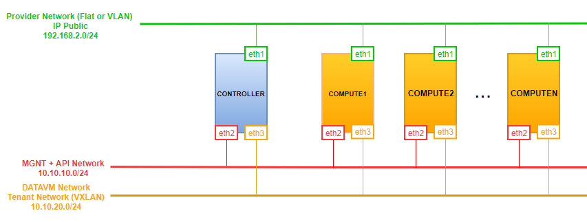
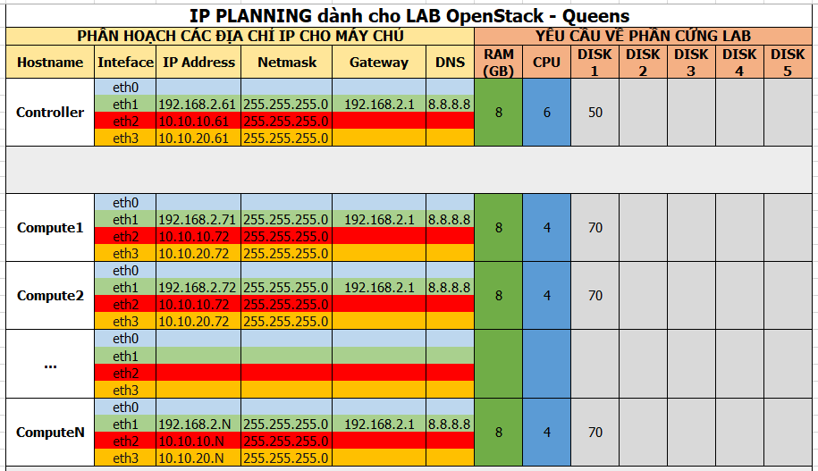

# Cài đặt OpenStack Queens trên Centos 7.5.18.04


# MỤC LỤC
- [1.Mô hình](#1mô-hình)
- [2.IP Planning](#2ip-planning)
- [3.Cài đặt thủ công](#3cài-đặt-thủ-công)
- [4.Thực hiện chạy scripts trên từng node Controller và Compute](#4thực-hiện-chạy-scripts-trên-từng-node-controller-và-compute)
- [5.Chú ý khi cài OpenStack phiên bản Queens sử dụng OpenvSwitch trên Centos 7.5.18.04](#5chú-ý-khi-cài-openstack-phiên-bản-queens-sử-dụng-openvswitch-trên-centos-751804)
  - [5.1.Chú ý 1](#51chú-ý-1)
  - [5.2.Chú ý 2](#52chú-ý-2)
  - [5.3.Chú ý 3](#53chú-ý-3)
  - [5.4.Chú ý 4](#54chú-ý-4)


# 1.Mô hình
\- Mô hình cài đặt OpenStack Queens gồm 1 node Controller, nhiều node Compute.  
\- Cài đặt các project: Keystone, Glance, Nova, Neutron, Horizon.  



# 2.IP Planning
Yêu cầu phần cứng và địa chỉ IP cho các nodes.  


# 3.Cài đặt thủ công
\- Tham khảo:
- https://docs.openstack.org/queens/install/
- https://docs.openstack.org/ocata/networking-guide/deploy.html

# 4.Thực hiện chạy scripts trên từng node Controller và Compute
\- Trên tất các node:
- Thực hiện đặt mật khẩu người dùng `root` trên tất cả các node sao cho giống nhau, ở đây mình đặt là `welcome123`.  
- Download các file shell scripts. Thực hiện các câu lệnh sau:  
```
yum install subversion -y
svn export https://github.com/doxuanson/Install-OpenStack/trunk/Queens/Centos7-1804-Scripts-run-on-per-node/OPS-setup
```

- Set quyền `755` cho các files đó.  
```
chmod -R 755 OPS-setup
```

- Thay đổi nội dung các file `OPS-setup/config.sh` theo mô hình của bạn.
- Trên node Controller, thực hiện lệnh:  
```
cd OPS-setup/CTL
source ctl-0-ipaddr.sh
init 6
```

- Trên các node Compute, thực hiện lệnh:   
```
cd OPS-setup/COM
source com-0-ipaddr.sh
init 6
```


\- Đứng từ một máy ở cùng dải mạng với interface `eth2` của các node, thực hiện ssh đến người dùng `root` của các node:  
- Trên node Controller, thực hiện lệnh:  
```
cd OPS-setup/CTL
source ctl-all.sh
```

- Sau khi cài đặt xong node Controller, chuyển sang các node Compute, sửa file `OPS-setup/COM/com_num.sh` tương ứng với số thú tự node Compute, thực hiện lệnh:  
```
cd OPS-setup/COM
source com-all.sh
```

# 5.Chú ý khi cài OpenStack phiên bản Queens sử dụng OpenvSwitch trên Centos 7.5.18.04
\- Quá trình cài theo docs:  
- https://docs.openstack.org/queens/install/
- https://docs.openstack.org/ocata/networking-guide/deploy.html

nhưng có 1 số chỗ bổ sung.  

## 5.1.Chú ý 1
\- Stop và disable `firewalld`, `selinux`.  

## 5.2.Chú ý 2
\- Trên node Controller, tại tất cả các project như Keystone, Glance, Nova, Neutron;  khi tạo database ta cần thêm người dùng:  
```
'<project_name'@'$CTL_MGNT_IP'
```

\- VD đối với Keystone và Nova:  
```
CREATE DATABASE keystone;
GRANT ALL PRIVILEGES ON keystone.* TO 'keystone'@'localhost' \
IDENTIFIED BY '$KEYSTONE_DBPASS';
GRANT ALL PRIVILEGES ON keystone.* TO 'keystone'@'%' \
IDENTIFIED BY '$KEYSTONE_DBPASS';
GRANT ALL PRIVILEGES ON keystone.* TO 'keystone'@'$CTL_MGNT_IP' \
IDENTIFIED BY '$KEYSTONE_DBPASS';
```

```
CREATE DATABASE nova_api;
CREATE DATABASE nova;
CREATE DATABASE nova_cell0;
GRANT ALL PRIVILEGES ON nova_api.* TO 'nova'@'localhost' \
  IDENTIFIED BY '$NOVA_DBPASS';
GRANT ALL PRIVILEGES ON nova_api.* TO 'nova'@'%' \
  IDENTIFIED BY '$NOVA_DBPASS';
GRANT ALL PRIVILEGES ON nova_api.* TO 'nova'@'$CTL_MGNT_IP' \
  IDENTIFIED BY '$NOVA_DBPASS';

GRANT ALL PRIVILEGES ON nova.* TO 'nova'@'localhost' \
  IDENTIFIED BY '$NOVA_DBPASS';
GRANT ALL PRIVILEGES ON nova.* TO 'nova'@'%' \
  IDENTIFIED BY '$NOVA_DBPASS';
GRANT ALL PRIVILEGES ON nova.* TO 'nova'@'$CTL_MGNT_IP' \
  IDENTIFIED BY '$NOVA_DBPASS';

GRANT ALL PRIVILEGES ON nova_cell0.* TO 'nova'@'localhost' \
  IDENTIFIED BY '$NOVA_DBPASS';
GRANT ALL PRIVILEGES ON nova_cell0.* TO 'nova'@'%' \
  IDENTIFIED BY '$NOVA_DBPASS';
GRANT ALL PRIVILEGES ON nova_cell0.* TO 'nova'@'$CTL_MGNT_IP' \
  IDENTIFIED BY '$NOVA_DBPASS';
```

## 5.3.Chú ý 3
\- Sau khi thực hiện lệnh:  
```
yum install openstack-neutron openstack-neutron-ml2 \
openstack-neutron-openvswitch ebtables -y
```

ta cần restart lại dịch vụ openvswitch:  
```
systemctl restart openvswitch
```

## 5.4.Chú ý 4
\- Thực hiện cài OpenStack bằng scripts trên lần lượt từng Compute, cài đặt xong trên `Compute1` rồi tiếp tục đến `Compute2`.  Vì khi thực đến lệnh:  
```
echocolor "Update"
source com-update.sh
```

trong file `OPS-setup/COM/com-all.sh`. Lệnh này có chứa tiến trình copy thư mục `OPS-setup` sang tất cả các node, mà nếu một node nào đó cũng đang sử dụng thư `OPS-setup` thì sẽ gây ra hiện tượng **xung đột**.  


