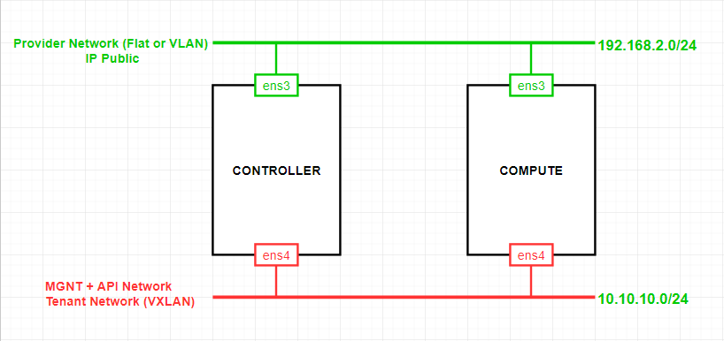
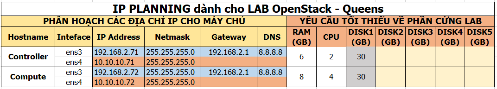

# Cài OpenStack Queens với Linux bridge

# MỤC LỤC
- [1.Mô hình](#1)
- [2.IP Planning](#2)
- [3.Cài thủ công theo](#3)

# 1.Mô hình
Mô hình cài đặt OpenStack Queens gồm 2 node: Controller và Compute.

# 2.IP Planning
Yêu cầu phần cứng và địa chỉ IP cho các nodes.

# 3.Cài thủ công

[Cài OpenStack Pike với Linux bridge](docs/Install_OPS_with_Linuxbridge.md)

