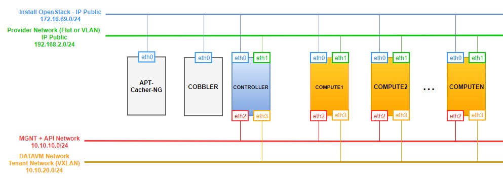
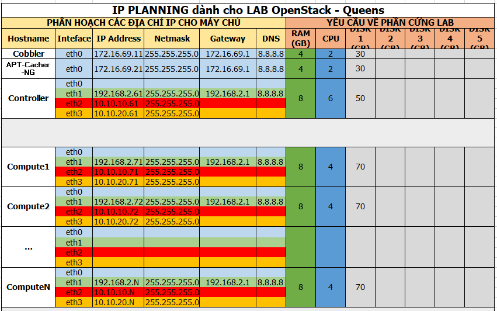
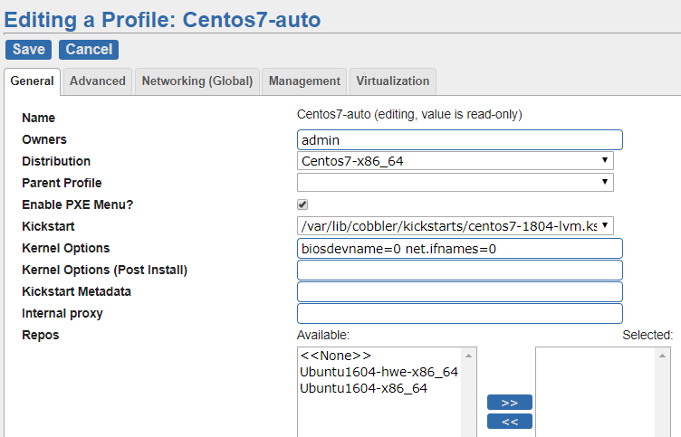
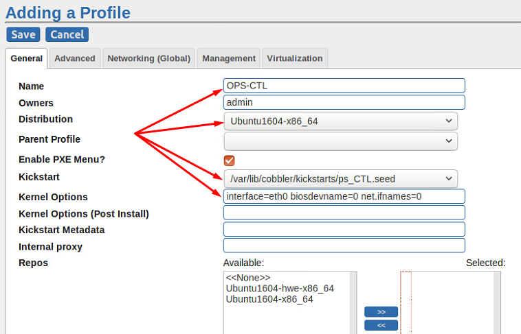
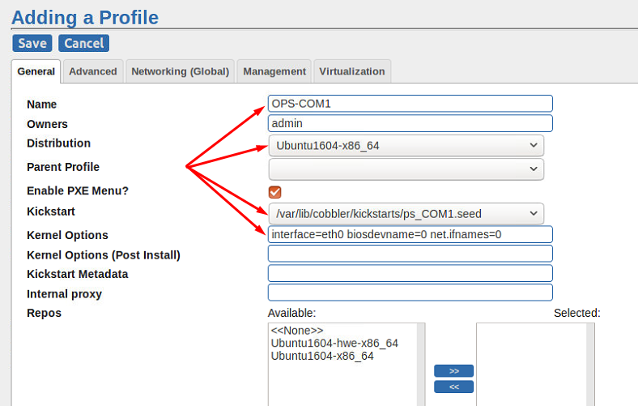
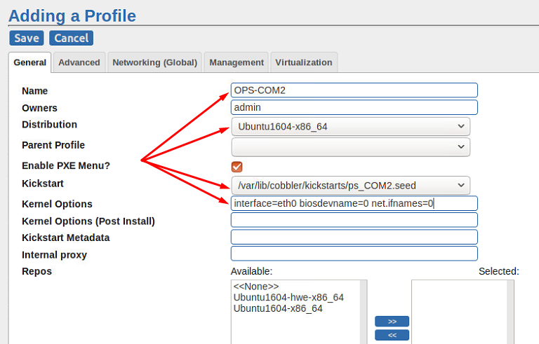
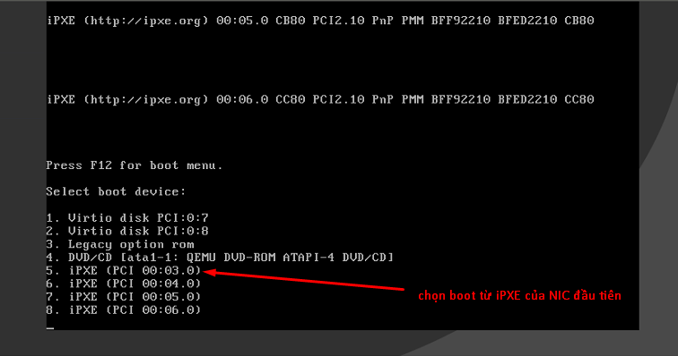
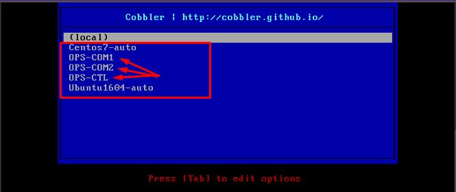

# Cài đặt OpenStack Queens trên Ubuntu 16.04 sử dụng Cobbler

# MỤC LỤC
- [1.Mô hình](#1mô-hình)
- [2.IP Planning](#2ip-planning)
- [3.Cài đặt trên Cobbler](#3cài-đặt-trên-cobbler)
  - [3.1.Cài đặt Cobbler](#31cài-đặt-cobbler)
  - [3.2.Import hệ điều hành Ubuntu 16.04 và Centos 7](#32import-hệ-điều-hành-ubuntu-1604-và-centos-7)
  - [3.3.Tạo file kickstart hệ điều hành Ubuntu 16.04 và Centos 7](#33tạo-file-kickstart-hệ-điều-hành-ubuntu-1604-và-centos-7)
    - [a.Ubuntu Server 16.04](#aubuntu-server-1604)
    - [b.Centos 7](#bcentos-7)
- [4.Cài đặt APT-CACHER-NG](#4cài-đặt-apt-cacher-ng)
- [5.Cấu hình cài đặt tự động cho OpenStack](#5cấu-hình-cài-đặt-tự-động-cho-openstack)
- [6.Hướng dẫn sử dụng](#6hướng-dẫn-sử-dụng)
  - [6.1.Tạo file preseed cho các node OpenStack](#61tạo-file-preseed-cho-các-node-openstack)
  - [6.2.Tạo profiles cho Controller, Compute](#62tạo-profiles-cho-controller-compute)
- [6.Demo](#6demo)
- [7.Chú ý khi cài OpenStack phiên bản Queens sử dụng OpenvSwitch trên Ubuntu 16.04 sử dụng Cobbler](#7chú-ý-khi-cài-openstack-phiên-bản-queens-sử-dụng-openvswitch-trên-ubuntu-1604-sử-dụng-cobbler)
  - [7.1.Chú ý 1](#71chú-ý-1)
  - [7.2.Chú ý 2](#72chú-ý-2)


# 1.Mô hình
\- Node `Cobbler` chạy hệ điều hành Centos 7.5.18.04.  
\- Node `APT-CACHER-NG` chạy hệ điều hành Ubuntu Server 16.04.  
\- Mô hình cài đặt OpenStack Queens gồm 1 node Controller, nhiều node Compute.  
\- Cài đặt các project: Keystone, Glance, Nova, Neutron, Horizon.   



# 2.IP Planning
Yêu cầu phần cứng và địa chỉ IP cho các nodes.  


# 3.Cài đặt trên Cobbler
## 3.1.Cài đặt Cobbler
\- Download script cài đặt Cobbler tại link:  
[Scripts cài Cobbler](scripts/cobbler-install.sh)  

\- Chú ý: Thiết lập các biến môi trường sao cho phù hợp mô hình.  
\- Thực hiện lệnh:  
```
chmod 755 cobbler-install.sh
source cobbler-install.sh
```

## 3.2.Import hệ điều hành Ubuntu 16.04 và Centos 7
\- Download file iso của các hệ điều hành về, ở đây tôi download **Ubuntu Server 16.04** và **Centos 7**. Thực hiện lệnh:  
```
wget http://releases.ubuntu.com/xenial/ubuntu-16.04.5-server-amd64.iso
wget http://centos-hn.viettelidc.com.vn/7/isos/x86_64/CentOS-7-x86_64-DVD-1804.iso
```

Sau khi download xong ta có 2 file `ubuntu-16.04.5-server-amd64.iso` và `CentOS-7-x86_64-DVD-1804.iso` .  
\- Thực hiện mount iso và import vào Cobbler. Thực hiện lệnh sau:  
Ubuntu:  
```
mkdir /mnt/ubuntu1604
mount -o loop ubuntu-16.04.5-server-amd64.iso /mnt/ubuntu1604
cobbler import --arch=x86_64 --path=/mnt/ubuntu1604 --name=Ubuntu1604
```

Centos:  
```
mkdir /mnt/centos7
mount -o loop CentOS-7-x86_64-DVD-1804.iso /mnt/centos7
cobbler import --arch=x86_64 --path=/mnt/centos7 --name=Centos7
```

\- Trong quá trình import, nếu có lỗi xảy ra thì thực hiện lệnh sau:  
```
cobbler signature update
```

\- Sau khi thực hiện import xong, ta thực hiện umount:  
```
umount /mnt/ubuntu1604
umount /mnt/centos7
```

## 3.3.Tạo file kickstart hệ điều hành Ubuntu 16.04 và Centos 7
### a.Ubuntu Server 16.04
\- Tạo file `ubuntu16.04.seed` trong thư mục `/var/lib/cobbler/kickstarts/` với nội dung như file:   [ubuntu16.04.seed](scripts/ubuntu16.04.seed) .  
\- Tạo profile tên `Ubuntu1604-auto`, với cấu hình như sau:  


Trường "Kernel Options" có nội dung: `interface=eth0 biosdevname=0 net.ifnames=0` .  

### b.Centos 7
\- Tạo file `centos7-1804.ks` trong thư mục `/var/lib/cobbler/kickstarts/` với nội dung như file:  
[centos7-1804-lvm.ks](scripts/centos7-1804-lvm.ks).  
\- Tạo profile tên `Centos7-auto`, với cấu hình như sau:  


Trường "Kernel Options" có nội dung: `biosdevname=0 net.ifnames=0` .  

# 4.Cài đặt APT-CACHER-NG
\- Sử dụng Cobbler, cài Ubuntu Server 16.04.  
\- Download script cài đặt Cobbler tại link:  
[Scripts cài apt-cacher-ng](scripts/apt-cacher-ng_install.sh)  

\- Chú ý: Thiết lập các biến môi trường sao cho phù hợp mô hình.  
\- Thực hiện lệnh:  
```
chmod 755 apt-cacher-ng_install.sh
source apt-cacher-ng_install.sh
```

# 5.Cấu hình cài đặt tự động cho OpenStack
\- Download các file shell scripts. Thực hiện các câu lệnh sau:  
```
apt install subversion -y
svn export https://github.com/doxuanson/Install-OpenStack/trunk/Queens/Ubuntu1604-KickStart/OPS-setup
svn export https://github.com/doxuanson/Install-OpenStack/trunk/Queens/Ubuntu1604-KickStart/preseed_OPS
```

\- Copy 2 thư mục vừa tải về vào thư mục `/var/www/html` :  
```
# cp -r OPS-setup /var/www/html
# cp -r kickstart_OPS /var/www/html
```

\- Thực hiện lệnh:  
```
chmod -R 755 /var/www/html/OPS-setup
chmod -R 755 /var/www/html/preseed_OPS
```

# 6.Hướng dẫn sử dụng
\- Thay đổi nội dung các file `/var/www/html/OPS-setup/config.sh` và `/var/www/html/preseed_OPS/config.sh` theo mô hình của bạn.  

>Chú ý: Mật khẩu cho node phải đồng nhất trong 2 file cấu hình.

\- Trong bài lab này, mình cài đặt mô hình OpenStack gồm 1 node Controller, nhiều node Compute.  

## 6.1.Tạo file preseed cho các node OpenStack
\- Dùng các file trong thư mục `/var/www/html/preseed_OPS` để sinh các file preseed cho các node OpenStack.  
```
cd /var/www/html/preseed_OPS
```

  - Sinh file preseed cho node Controller:  
  ```
  source CTL_ps_create.sh
  ```

  - Sinh file preseed cho node Compute1, đầu tiên cho thiết lập biến `com_num` bằng `1` (`com_num=1`) trong file config.sh, sau đó:
  ```
  source COM_ps_create.sh
  ```

  - Tương tự sinh file preseed cho node Compute2, thiết lập biến `com_num` bằng `2` (`com_num=2`) trong file config.sh, sau đó:  
  ```
  source COM_ps_create.sh
  ```

Các file sinh ra sẽ có tên lần lượt như sau:  
`ks_CTL.seed`, `ks_COM1.seed`, `ks_COM2.seed`.  

\- Copy các file vừa sinh ra sang thư mục preseed của Cobbler:  
```
cp /var/www/html/preseed_OPS/ps_CTL.seed /var/lib/cobbler/kickstarts
cp /var/www/html/preseed_OPS/ps_COM1.seed /var/lib/cobbler/kickstarts
cp /var/www/html/preseed_OPS/ps_COM2.seed /var/lib/cobbler/kickstarts
```

## 6.2.Tạo profiles cho Controller, Compute
\- Controller:  


\- Compute1:  


\- Compute2:  


# 6.Demo





# 7.Chú ý khi cài OpenStack phiên bản Queens sử dụng OpenvSwitch trên Ubuntu 16.04 sử dụng Cobbler
\- Quá trình cài theo docs:  
- https://docs.openstack.org/queens/install/
- https://docs.openstack.org/ocata/networking-guide/deploy.html

nhưng có 1 số chỗ bổ sung.  

## 7.1.Chú ý 1
\- Trên node Controller, sau khi thực hiện lệnh:  
```
apt install neutron-server neutron-plugin-ml2 \
	neutron-openvswitch-agent neutron-l3-agent neutron-dhcp-agent \
	neutron-metadata-agent -y
```

ta cần restart lại dịch vụ openvswitch:  
```
systemctl restart openvswitch-switch
```

\- Trên node Compute, sau khi thực hiện lệnh:  
```
apt install neutron-openvswitch-agent -y
```

ta cần restart lại dịch vụ openvswitch:  
```
systemctl restart openvswitch-switch
```

## 7.2.Chú ý 2
\- Thực hiện cài OpenStack bằng scripts trên lần lượt từng Compute, cài đặt xong trên `Compute1` rồi tiếp tục đến `Compute2`.  Vì khi thực đến lệnh:  
```
echocolor "Update"
source com-update.sh
```

trong file `OPS-setup/COM/com-all.sh`. Lệnh này có chứa tiến trình copy thư mục `OPS-setup` sang tất cả các node, mà nếu một node nào đó cũng đang sử dụng thư `OPS-setup` thì sẽ gây ra hiện tượng **xung đột**.  


